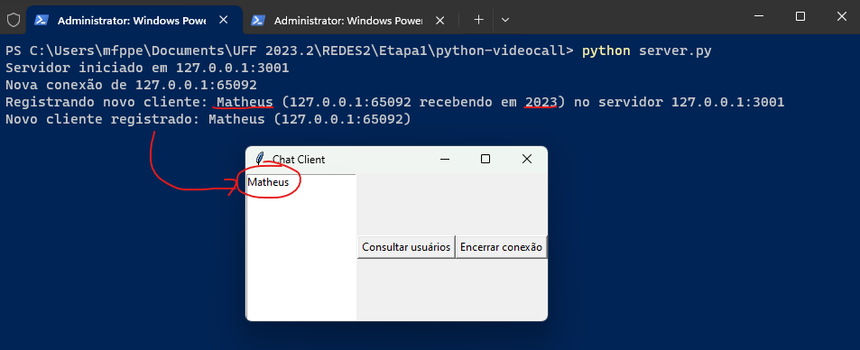

# Relatório sobre a ETAPA 1 do trabalho prático

## Escopo da atividade:

### A atividade prática da disciplina consiste em desenvolver uma aplicação de videoconferência descentralizada. Para isso, deve ser utilizada comunicação por sockets, permitindo que os usuários primeiro se registrem em um servidor e consultem a lista de nós cadastrados, para depois de conectarem aos seus pares utilizando o modelo Peer-to-Peer (P2P).

---

## Escopo da ETAPA 1:

### Desenvolver a parte de registro e consultas no servidor. Nesta etapa, é necessário implementar um socket TCP que interconecte os clientes e o servidor.

---

## Grupo:
- Anderson Meireles
- Matheus Campos
- Matheus Folly

### As atividades foram realizadas em conjunto de forma que os integrantes participassem na compreensão e desenvolvimento de forma coletiva, não foram designadas funções específicas a serem implementadas por cada membro.
---

## Uso da aplicação (como executar o código):

### Para executar essa aplicação local é necessário:
* Ter python 3 instalado na máquina
* Clonar o repositório do github ou copiar os arquivos para uma pasta local
* Abrir 2 terminais nesse mesmo diretório (1 terminal para o servidor e 1 terminal para o cliente)
* Executar `python server.py` no terminal que for rodar o servidor
* Executar `python client.py` no terminal que for rodar o cliente e responder os inputs
* Validar se o cadastro foi realizado com sucesso
* Verificar detalhes do usuário cadastrado (double click no nome do usuário)

#### Exemplo visual:

> Repositório clonado do github (poderia ser uma pasta com os arquivos `client.py` e `server.py` também)


> Abrindo o terminal no diretório que contém os arquivos `client.py` e `server.py`


> Iniciando o servidor


> Iniciando um cliente


> Validando que o cliente de fato foi registrado no servidor


> Verificar detalhes do usuário cadastrado (double click no nome do usuário)


---

## Erros esperados na execução da aplicação (tratados):

> Cadastro de usuário com mesmo nome e IP


> Cadastro de novo usuário com mesmo IP e porta


> Cadastro de novo usuário passando a porta do servidor


> Terminal do servidor durante algumas das execuções acima


---

## Erros conhecidos:

> Encerrar a conexão do cliente fechando a interface em vez de clicar em `Encerrar conexão`


---

## Implementação:

### Servidor:

### Armazenar e imprimir uma tabela dinâmica contendo informações dos clientes:
```python
...
    # Cria um dicionário para armazenar as informações do cliente
    client = {'name': name, 'ip': ip, 'port': port, 'call_port': call_port, 'socket': client_socket}
    # Adiciona o cliente à lista de clientes
    self.clients.append(client)
...
```
> Parte responsável por armazenar o client na lista de clients, só é adicionado após os inputs serem validados e não possuírem nenhuma violação que retorne a função antes de chegar nessa parte

```python
# Define um método para obter a lista de clientes
def get_client_list(self):
    # Cria uma lista com os nomes dos clientes
    client_list = [client['name'] for client in self.clients]
    # Retorna a lista de clientes como uma string
    return ','.join(client_list)
```
> Parte responsável por imprimir as informações dos clients, retorna todos os clientes cadastrados no servidor.

---

### Imprimir mensagem de confirmação de registro de novo usuário:
```python
...
    # Imprime uma mensagem indicando que o cliente foi registrado
    print(f"Novo cliente registrado: {name} ({ip}:{port})")
    # Envia uma mensagem de sucesso para o cliente
    self.send_message(client_socket, 'success,Registrado com sucesso')
...
# Define um método para enviar uma mensagem
def send_message(self, client_socket, message):
    # Envia a mensagem para o cliente
    client_socket.send(message.encode())
```
> Após passar pelas validações e o cliente for adicionado a lista de clients, uma mensagem é exibida tanto no servidor quanto enviada para o client para confirmar o cadastro.

---

### Caso o usuário já esteja cadastrado, imprimir mensagem informando esta condição:
```python
...
    # Itera sobre os clientes existentes
    for client in self.clients:
        # Se um cliente com o mesmo nome e IP já existir, envia uma mensagem de erro
        if client['name'] == name and client['ip'] == ip:
            self.send_error(client_socket, 'Usuário já registrado')
            return
        # Se um cliente com o mesmo IP e call_port já existir, envia uma mensagem de erro
        elif client['ip'] == ip and client['call_port'] == call_port:
            self.send_error(client_socket, f'Falha ao registrar cliente: {name} - Já existe um usuário com esse IP recebendo chamadas nessa porta')
            return
...
# Define um método para enviar uma mensagem de erro
def send_error(self, client_socket, error_message):
    response = f'error,{error_message}'
    # Imprime a mensagem de erro
    print(response.split(',')[1])
    # Envia a mensagem de erro para o cliente
    self.send_message(client_socket, response)
```
> Após varrer a lista e identificar se o usuário ja está cadastrado, o servidor envia uma mensagem avisando do erro e retorna para não finalizar o cadastro.

---

### Responder aos clientes o nome de um nó conectado e seus respectivos endereços e números de porta, quando assim solicitado:

```python
# Define um método para obter os detalhes do cliente
def get_client_details(self, user):
    # Itera sobre os clientes
    for client in self.clients:
        # Se o nome do cliente corresponder ao usuário especificado, retorna o IP e a porta de chamada do cliente
        if client['name'] == user:
            return f"{client['ip']},{client['call_port']}"
```
> Retorna o endereço e porta cadastrado para aquele client

---

### Caso o cliente solicite o fim da conexão, o servidor deve responder com mensagem de encerramento e, depois, fechar o socket:

```python
...
    # Se a mensagem for 'quit', desconecta o cliente
    elif message == 'quit':
        self.disconnect_client(client_socket, client)
        break
...
# Define um método para desconectar um cliente
def disconnect_client(self, client_socket, client):
    # Envia uma mensagem para o cliente informando que a conexão foi encerrada
    client_socket.send('Conexão encerrada'.encode())
    # Fecha o socket do cliente
    client_socket.close()
    # Se o cliente estiver na lista de clientes, remove-o
    if client in self.clients:
        self.clients.remove(client)
    # Imprime uma mensagem indicando que o cliente foi desconectado
    print(f"Cliente desconectado: {client['name']} ({client['ip']}:{client['port']})")
```
> Se no while que gerencia os clients o client clicar no botão que encerra a conexão, o mesmo client receberá um aviso de que a conexão com o servidor está sendo encerrada, o servidor então irá fechar o socket e remover o client da lista de clients

---

## Cliente:

### Registrar-se no servidor utilizando um nome e um IP exclusivos e indicando a porta apta para receber o pedido de chamada:

```python
# Define um método para registrar o cliente no servidor
def register(self, name, client_call_port):
    # Cria uma mensagem com o nome, IP, porta e porta de chamada do cliente
    message = ','.join([name, self.ip, str(self.port), str(client_call_port)])
    # Envia a mensagem para o servidor
    self.client_socket.send(message.encode())
    # Recebe uma resposta do servidor
    response = self.client_socket.recv(1024).decode().split(',')
    # Imprime a resposta
    print(response[1])
    # Se a resposta for um erro, fecha o socket do cliente e encerra o programa
    if response[0] == 'error':
        self.client_socket.close()
        exit()
```
> Após receber de input do usuário o nome e porta (tendo o IP do localhost), o cliente envia a mensagem para o servidor para se registrar e aguarda a resposta do servidor confirmando se foi registrado ou não

---

### Realizar consultas de endereços de portas por nomes específicos dos usuários:

```python
# Define um método para mostrar os detalhes de um usuário
def show_user_details(self, user):
    # Envia uma mensagem para o servidor solicitando os detalhes do usuário
    self.send_message(f'details,{user}')
    # Recebe os detalhes do usuário do servidor
    response = self.client_socket.recv(1024).decode()
    # Divide a resposta em IP e porta
    ip, port = response.split(',')
    # Cria uma nova janela para mostrar os detalhes do usuário
    detail_window = tk.Toplevel(self.root)
    detail_window.title(f"Detalhes de {user}")
    # Cria um rótulo para mostrar o IP e a porta do usuário
    detail_label = tk.Label(detail_window, text=f"IP: {ip}\nPorta: {port}")
    detail_label.pack(side=tk.TOP)
```
> Solicita para o servidor detalhes do usuário passado como argumento do send_message.

---

### Caso o cliente deseje se desvincular do servidor de registro, ele deve enviar uma mensagem com esta solicitação:

```python
# Define um método para enviar uma mensagem para o servidor
def send_message(self, message):
    # Envia a mensagem para o servidor
    self.client_socket.send(message.encode())
    # Se a mensagem for 'quit', recebe uma resposta do servidor, imprime a resposta, fecha o socket do cliente e encerra a interface do usuário
    if message == 'quit':
        response = self.client_socket.recv(1024).decode()
        print(response)
        self.client_socket.close()
        self.root.quit()
```
> No próprio send_message, se a mensagem passada como argumento for 'quit', ele envia a solicitação para encerrar a conexão com o servidor para o servidor e depois o cliente da close no seu próprio socket.